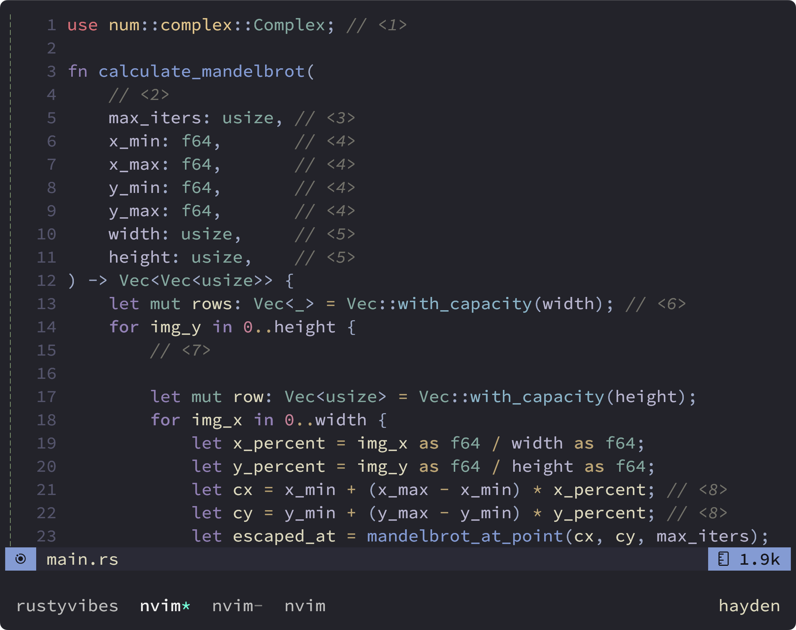

## Neovim



## Use zsh as main shell

Add this code below to ~/.zshrc

```
if [ -r ~/.config/zsh/.zshrc ]; then
  source ~/.config/zsh/.zshrc
fi
```

## Brew Bundle

```
brew bundle install
```

Looks for `~/Brewfile` and installs its contents

### Creating a Brewfile

Current directory

```
brew bundle dump
```

if a Brewfile already exists, need to do

```
brew bundle dump --force
```

### Install a specific brewfile

If you want to use a brewfile from a non-standard place.

```
brew bundle --file=~/.private/Brewfile
```

Or more specifically:

```
brew bundle install --file=rs-brew-dump
```

If you want your current system configuration to match your brewfile

```
brew bundle --force cleanup
```

## Change keyrepeat macOS

InitialKeyRepeat 15, 12, 10,...

```
defaults read | grep -i 'keyrepeat' # check all defaults for keyrepeat
defaults write -g InitialKeyRepeat -int 12 # normal minimum is 15 (225 ms)
defaults write -g KeyRepeat -int 1 # normal minimum is 2 (30 ms)
```

NOTE: The changes aren't applied until you log out and back in.
